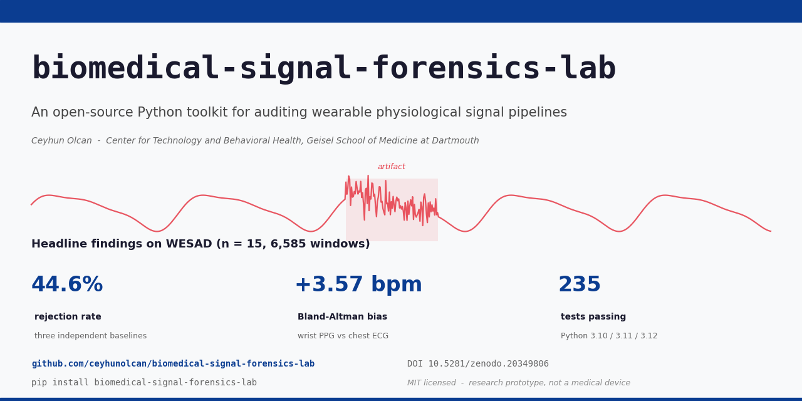
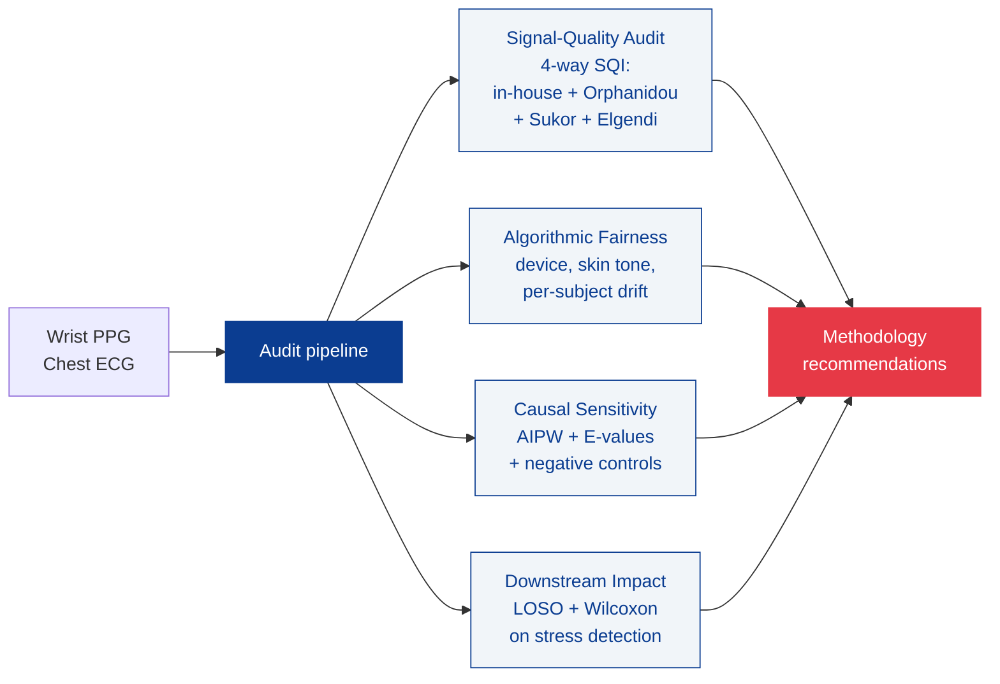

<p align="center">
  
</p>

<h1 align="center">biomedical-signal-forensics-lab</h1>

<p align="center">
  <em>An open-source Python toolkit for auditing wearable physiological signal pipelines.</em>
</p>

<p align="center">
  <a href="https://pypi.org/project/biomedical-signal-forensics-lab/"></a>
  <a href="https://pypi.org/project/biomedical-signal-forensics-lab/"></a>
  <a href="https://pepy.tech/project/biomedical-signal-forensics-lab"></a>
  <a href="https://ceyhunolcan.github.io/biomedical-signal-forensics-lab/"></a>
  <a href="https://github.com/ceyhunolcan/biomedical-signal-forensics-lab/actions/workflows/tests.yml"></a>
  <a href="https://doi.org/10.5281/zenodo.20349806"></a>
  <a href="https://github.com/ceyhunolcan/biomedical-signal-forensics-lab/blob/main/LICENSE"></a>
</p>

<p align="center">
  <strong>Research prototype only. Not medical advice, diagnosis, treatment, or a medical device.</strong>
</p>

It targets four failure modes that commonly invalidate downstream conclusions
in digital-health research:

1. **Signal-quality thresholds** that pass on real wrist PPG despite
   consensus rejection by published baselines.
2. **Algorithmic-fairness disparities** driven by device family, skin
   tone, and other site-of-inequity variables.
3. **Confounded causal interpretations** that reverse sign under
   back-door adjustment.
4. **Downstream-task degradation** measurable in classifier AUROC under
   different preprocessing choices.

## Architecture

The toolkit organises the audit into four cooperating components, each
producing quantitative evidence that feeds a single set of methodology
recommendations.



GitHub renders mermaid natively, so the figure above appears inline without
any external image hosting.

## Key results on WESAD (n = 15 subjects, 6,585 thirty-second windows)

| Metric | Value | Interpretation |
|---|---|---|
| Three-baseline rejection rate | **44.6%** | 2,936 of 6,585 windows rejected by Orphanidou, Sukor, or Elgendi |
| Bland-Altman bias (wrist PPG HR vs chest ECG HR) | **+3.57 bpm** | 95% limits of agreement [-23.14, +30.28] |
| Mean absolute error | **9.66 bpm** | Pearson r = +0.70 across all windows |
| Pairwise SQI agreement (median) | **kappa = -0.20** | Three baselines disagree on which windows to keep |
| Downstream effect after recalibration | **delta kappa = 0.000** | Quality filtering does not improve stress detection at n=15 |
| Downstream correlation | **rho = +0.10**, Wilcoxon p = 1.5e-4 | Small but significant paired effect |
| LOSO AUROC change | **0.804 to 0.823** | +0.019 with full audit pipeline |
| Test suite | **235 passing** | Python 3.10 / 3.11 / 3.12 |

## What this toolkit does

| Module | Function |
|---|---|
| `biomedical_signal_forensics_lab.signals` | PPG and ECG preprocessing; four signal-quality baselines (in-house, Orphanidou 2015, Sukor 2011, Elgendi 2016) |
| `biomedical_signal_forensics_lab.evaluation` | Real-data validation against WESAD (n=15 subjects, 6,585 windows); four-way SQI agreement; Bland-Altman; bootstrap CIs |
| `biomedical_signal_forensics_lab.confounding` | Causal sensitivity analysis: back-door adjustment, AIPW doubly-robust estimation, E-values |
| `biomedical_signal_forensics_lab.reliability` | ICC computation, test-retest stability, bootstrap reliability |
| `biomedical_signal_forensics_lab.models` | Downstream LF/HF biomarker classifier with LOSO cross-validation |
| `biomedical_signal_forensics_lab.reports` | Publication-grade figure generation and summary JSON writers |

## Quickstart

Install from PyPI:

```bash
pip install biomedical-signal-forensics-lab
```

Or install from source:

```bash
git clone https://github.com/ceyhunolcan/biomedical-signal-forensics-lab.git
cd biomedical-signal-forensics-lab
python -m venv .venv && source .venv/bin/activate
pip install -e .
```

Run the test suite (should print 235 passed):

```bash
python scripts/run_tests_minimal.py
```

Run the synthetic pipeline (no external data needed):

```bash
python scripts/run_pipeline.py
```

Run the WESAD real-data validation (requires the WESAD dataset):

```bash
# Download WESAD from https://archive.ics.uci.edu/dataset/465/wesad
python scripts/run_deep_real_analysis.py --path /path/to/WESAD
```

Outputs land in `results/`. Figures land in `paper/figures/`.

## Reproducing the paper analyses

The full analysis pipeline used in the manuscript is reproducible end-to-end:

```bash
python scripts/run_pipeline.py                  # synthetic cohort (Sections 3-4.5)
python scripts/run_deep_real_analysis.py        # WESAD real data (Sections 4.1-4.3)
python scripts/run_extended_analyses.py         # supplementary analyses
python scripts/run_downstream_audit_demo.py     # downstream classifier (Section 4.6)
python scripts/generate_flow_diagram.py         # Figure 1 (STARD flow)
```

Each script writes a JSON summary to `results/` that the manuscript references
directly. The manuscript and supplementary materials are in `paper/`.

## Reporting standards compliance

Per-item compliance documentation for the EQUATOR-Network reporting standards
relevant to digital-health AI research:

- `paper/checklists/tripod_ai_checklist.md` (TRIPOD+AI, Collins et al. 2024)
- `paper/checklists/stard_2015_checklist.md` (STARD 2015, Bossuyt et al. 2015)
- `paper/checklists/consort_ai_applicability.md` (CONSORT-AI, Liu et al. 2020, does not apply, with rationale)
- `paper/checklists/decide_ai_applicability.md` (DECIDE-AI, Vasey et al. 2022, does not apply, with rationale)

A STARD-style data flow diagram is provided as Figure 1
(`paper/figures/fig_flow_diagram.png`).

## Documentation

Online documentation with API reference, getting-started guide, and
reproduction instructions:
https://ceyhunolcan.github.io/biomedical-signal-forensics-lab/

## Citing this software

If you use this toolkit in academic work, please cite the software:

```bibtex
@software{olcan2026biomedical,
  author       = {Olcan, Ceyhun},
  title        = {{biomedical-signal-forensics-lab}: An open-source toolkit
                  for auditing wearable physiological signal pipelines},
  year         = {2026},
  version      = {v0.16.0},
  url          = {https://github.com/ceyhunolcan/biomedical-signal-forensics-lab},
  doi          = {10.5281/zenodo.20349806}
}
```

The "Cite this repository" button in the right sidebar of the GitHub repo page
surfaces the same metadata in plain text and BibTeX from
[`CITATION.cff`](CITATION.cff).

## License

MIT. See [LICENSE](LICENSE).

## Contact

Ceyhun Olcan,
Center for Technology and Behavioral Health,
Geisel School of Medicine at Dartmouth,
Lebanon, NH 03766, USA.
Email: ceyhun.olcan.27 [at] dartmouth.edu.
ORCID: [0000-0002-6326-6071](https://orcid.org/0000-0002-6326-6071).

## Acknowledgments

This toolkit makes use of the public WESAD dataset released by Schmidt et al.
(2018) and builds methodologically on the signal-quality indices of Orphanidou
et al. (2015), Sukor et al. (2011), and Elgendi (2016). Reporting-standards
guidance follows TRIPOD+AI (Collins et al. 2024) and STARD 2015 (Bossuyt et al.
2015). Full bibliographic details are in [`paper/paper.bib`](paper/paper.bib).
