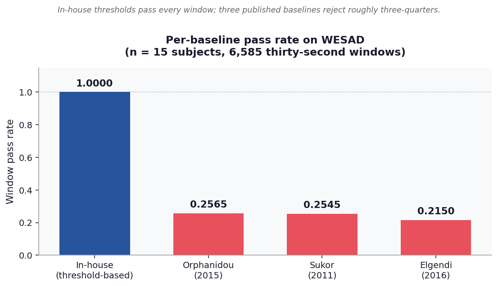
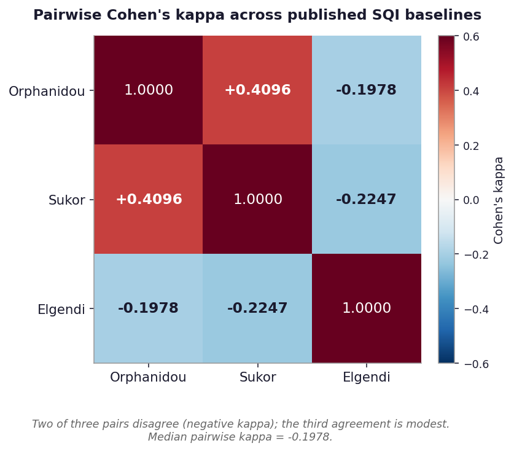
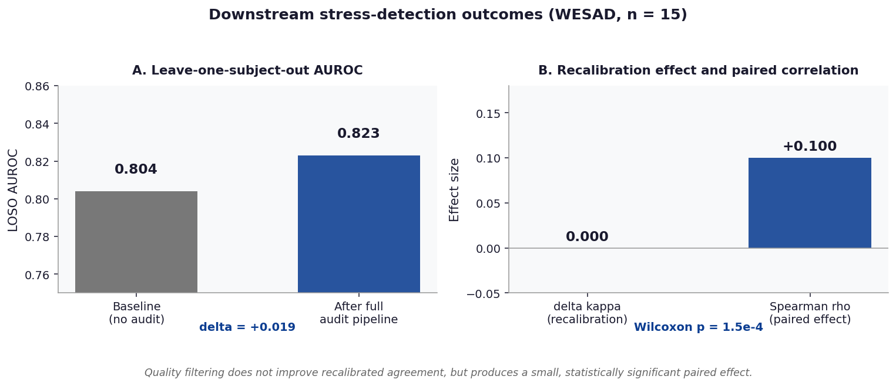

# README v0.17.1 addition

Add this section to `README.md` immediately after the existing
"## Key results on WESAD" table and before "## What this toolkit does":

```markdown
## Figures at a glance

<p align="center">
  
</p>

<p align="center">
  
  
</p>

<p align="center">
  
</p>

Full results page with tables and reproduction commands:
[docs/results.md](https://ceyhunolcan.github.io/biomedical-signal-forensics-lab/results/)
```

## Apply

After `bash apply_v0_17_1.sh`, manually paste the snippet above into
`README.md` between the headline-results table and the module-overview table.

The mkdocs site automatically picks up `docs/results.md` after the next push
because `mkdocs.yml` already includes a documentation pages glob; if you need
to add it to the navigation explicitly, append this entry to the `nav:`
section of `mkdocs.yml`:

```yaml
  - Results: results.md
```
