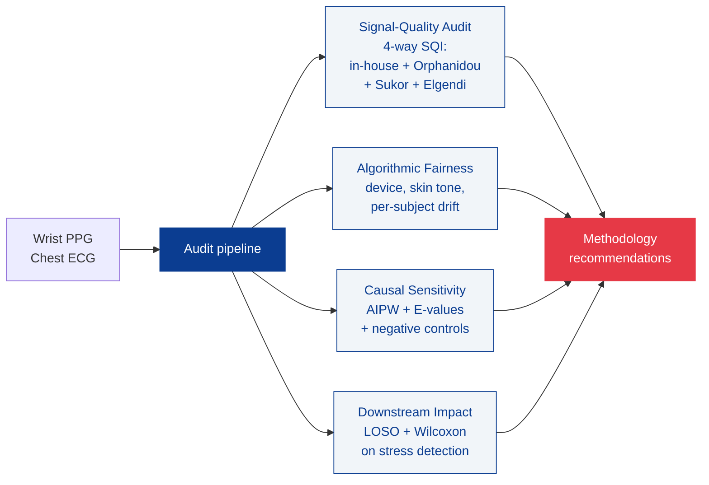

# README v0.17.0 update snippets

## 1. Top of README (replace existing title block)

Replace everything from the H1 heading through the badges row with this block:

```markdown
<p align="center">
  
</p>

<h1 align="center">biomedical-signal-forensics-lab</h1>

<p align="center">
  <em>An open-source Python toolkit for auditing wearable physiological signal pipelines.</em>
</p>

<p align="center">
  <a href="https://pypi.org/project/biomedical-signal-forensics-lab/"></a>
  <a href="https://pypi.org/project/biomedical-signal-forensics-lab/"></a>
  <a href="https://pepy.tech/project/biomedical-signal-forensics-lab"></a>
  <a href="https://ceyhunolcan.github.io/biomedical-signal-forensics-lab/"></a>
  <a href="https://github.com/ceyhunolcan/biomedical-signal-forensics-lab/actions/workflows/tests.yml"></a>
  <a href="https://doi.org/10.5281/zenodo.20349806"></a>
  <a href="https://github.com/ceyhunolcan/biomedical-signal-forensics-lab/blob/main/LICENSE"></a>
</p>

<p align="center">
  <strong>Research prototype only. Not medical advice, diagnosis, treatment, or a medical device.</strong>
</p>
```

## 2. Architecture diagram (insert after the intro paragraph, before "Quick start")

```markdown
## Architecture

The toolkit organises the audit into four cooperating components, each producing
quantitative evidence that feeds a single set of methodology recommendations.



GitHub renders mermaid diagrams natively, so the figure above appears inline in
the README without any image hosting.
```

## 3. Key results section (insert immediately after Architecture, before Quick start)

```markdown
## Key results on WESAD (n = 15 subjects, 6,585 thirty-second windows)

| Metric | Value | Interpretation |
|---|---|---|
| Three-baseline rejection rate | **44.6%** | 2,936 of 6,585 windows rejected by Orphanidou, Sukor, or Elgendi |
| Bland-Altman bias (wrist PPG HR vs chest ECG HR) | **+3.57 bpm** | 95% limits of agreement [-23.14, +30.28] |
| Mean absolute error | **9.66 bpm** | Pearson r = +0.70 across all windows |
| Pairwise SQI agreement (median) | **kappa = -0.20** | Three baselines disagree on which windows to keep |
| Downstream effect after recalibration | **delta kappa = 0.000** | Quality filtering does not improve stress detection at n=15 |
| Downstream correlation | **rho = +0.10**, Wilcoxon p = 1.5e-4 | Small but significant paired effect |
| LOSO AUROC change | **0.804 -> 0.823** | +0.019 with full audit pipeline |
| Test suite | **235 passing** | Python 3.10 / 3.11 / 3.12 |
```

## How to apply

Run `bash apply_v0_17_0.sh` from the repository root. It copies the social
preview image into `docs/assets/`, prints the snippets above for you to paste
into the README, and reminds you to upload the social preview at:

  https://github.com/ceyhunolcan/biomedical-signal-forensics-lab/settings

(scroll to "Social preview" and click "Edit", then upload
`docs/assets/social_preview.png`).
