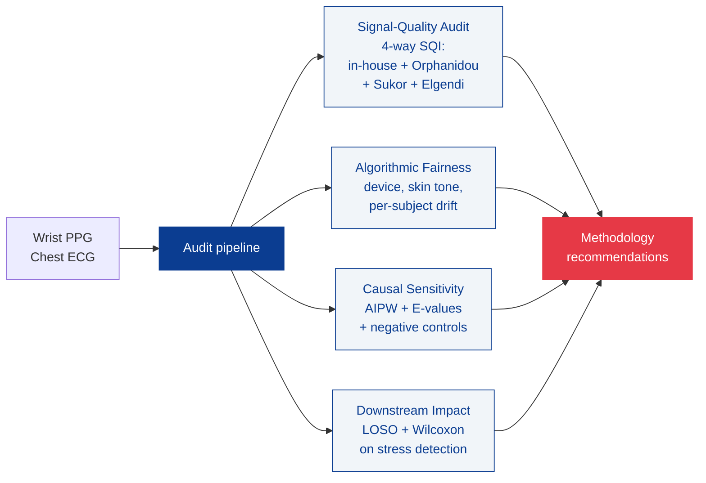

# biomedical-signal-forensics-lab

*An open-source Python toolkit for auditing wearable physiological signal
pipelines.*

[](https://pypi.org/project/biomedical-signal-forensics-lab/)
[](https://pypi.org/project/biomedical-signal-forensics-lab/)
[](https://github.com/ceyhunolcan/biomedical-signal-forensics-lab/actions/workflows/ci.yml)
[](https://doi.org/10.5281/zenodo.20349806)
[](https://github.com/ceyhunolcan/biomedical-signal-forensics-lab/blob/main/LICENSE)

!!! warning "Research prototype only"
    This toolkit is a research prototype. It is not medical advice, diagnosis,
    treatment, or a medical device. Outputs are statistical estimates only.

## What it does

Auditing wearable physiological signal pipelines for four failure modes that
commonly invalidate downstream conclusions in digital-health research.



## Installation

```bash
pip install biomedical-signal-forensics-lab
```

Or from source for development:

```bash
git clone https://github.com/ceyhunolcan/biomedical-signal-forensics-lab.git
cd biomedical-signal-forensics-lab
python -m venv .venv && source .venv/bin/activate
pip install -e ".[dev]"
pytest
```

## Three-line example

```python
from biomedical_signal_forensics_lab.signals import orphanidou_sqi, sukor_sqi, elgendi_sqi
from biomedical_signal_forensics_lab.data import load_wesad

windows = load_wesad("/path/to/WESAD")
report = {sqi.__name__: sqi(windows) for sqi in (orphanidou_sqi, sukor_sqi, elgendi_sqi)}
```

## Headline findings on WESAD (n = 15)

| Metric | Value | Source |
|---|---|---|
| Three-baseline consensus rejection rate | **44.6%** | `results/wesad_deep_analysis.json` |
| Bland-Altman bias (PPG minus ECG) | **+3.57 bpm** | LoA [-23.14, +30.28] |
| Median pairwise SQI Cohen's kappa | **-0.20** | three published baselines |
| LOSO AUROC after audit | **0.823** | up from 0.804 (delta = +0.019) |
| Test suite | **235 passing** | Python 3.10 / 3.11 / 3.12 |

[Full results page with figures and tables](results.md){ .md-button .md-button--primary }
[Methods documentation](methods.md){ .md-button }
[Comparison vs other tools](comparison.md){ .md-button }

## Where to next

- [Getting started](getting_started.md): installation, environment, first run
- [Reproducing the paper](reproducing_paper.md): end-to-end commands to regenerate every figure and table in the manuscript
- [Reporting standards](reporting_standards.md): TRIPOD+AI, STARD, CONSORT-AI, DECIDE-AI compliance
- [API reference](api/index.md): auto-generated from docstrings via mkdocstrings
- [Citing](citing.md): BibTeX, CITATION.cff, Zenodo DOI

## Author and contact

Ceyhun Olcan,
Center for Technology and Behavioral Health,
Geisel School of Medicine at Dartmouth,
Lebanon, NH, USA.
ORCID: [0000-0002-6326-6071](https://orcid.org/0000-0002-6326-6071).

## How to cite

```bibtex
@software{olcan2026biomedical,
  author       = {Olcan, Ceyhun},
  title        = {{biomedical-signal-forensics-lab}: An open-source toolkit
                  for auditing wearable physiological signal pipelines},
  year         = {2026},
  version      = {v0.16.0},
  url          = {https://github.com/ceyhunolcan/biomedical-signal-forensics-lab},
  doi          = {10.5281/zenodo.20349806}
}
```
