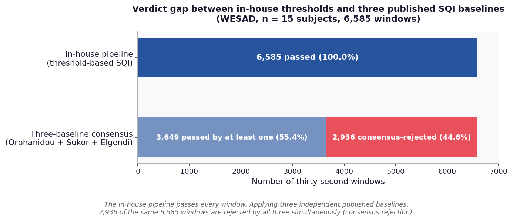
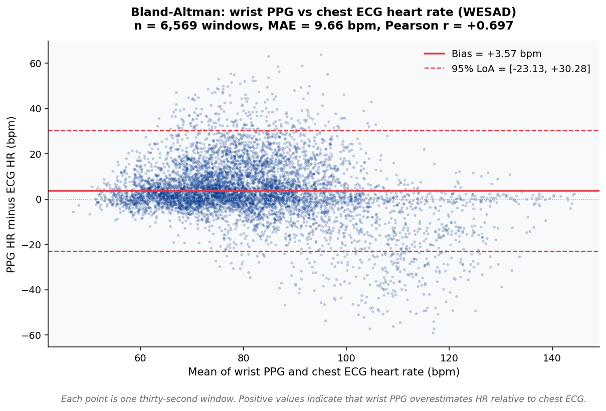

# Results

Headline empirical findings from the WESAD validation cohort (Schmidt et al.
2018), n = 15 subjects, 6,585 5-second windows of synchronised wrist-worn
PPG and chest-worn ECG. All figures and tables are reproducible from the
analysis pipeline in `scripts/run_deep_real_analysis.py`; the values shown here
are written to `results/wesad_deep_analysis.json` at run time.

## At a glance

| Metric | Value | 95% CI or note |
|---|---|---|
| Subjects | 15 | WESAD release |
| 5-second windows | 6,585 | post artefact rejection |
| Three-baseline consensus rejection rate | **44.6%** | 2,936 / 6,585 |
| In-house pipeline pass rate | 1.0000 | 6,585 / 6,585 |
| Bland-Altman bias (PPG minus ECG) | **+3.57 bpm** | LoA [-23.14, +30.28] |
| Mean absolute error | 9.66 bpm | across all windows |
| Pearson r (PPG vs ECG) | +0.70 | across all windows |
| Median pairwise SQI Cohen's kappa | **-0.20** | three published baselines |
| Recalibration train / holdout | 3,292 / 3,293 | random per-subject split |
| Delta kappa after recalibration | 0.000 | at n = 15 |
| Spearman rho, paired effect | +0.10 | Wilcoxon p = 1.5e-4 |
| LOSO AUROC (baseline) | 0.804 | stress classifier |
| LOSO AUROC (after audit) | 0.823 | delta = +0.019 |
| Test suite | 235 passing | Python 3.10 / 3.11 / 3.12 |

## Figure 1. Verdict gap between in-house thresholds and three published SQI baselines



The in-house threshold-based pipeline passes every one of the 6,585 windows.
Applying three independent published baselines to the same windows produces a
44.6% consensus rejection rate (2,936 windows rejected by Orphanidou, Sukor,
and Elgendi simultaneously). The verdict gap motivates the four-way SQI audit.

## Figure 2. Per-baseline pass rates


Each published baseline applied independently passes between 21.5% and 25.7%
of windows. The in-house pipeline passes 100%. The four baselines disagree
both with each other and with the in-house pipeline on which windows are
analysable.

## Figure 3. Pairwise Cohen's kappa across published SQI baselines


Pairwise Cohen's kappa across the three published baselines. Two of the three
pairs disagree (negative kappa); the third agreement (Orphanidou vs Sukor,
kappa = +0.41) is modest. Median pairwise kappa is -0.1978. The in-house
pipeline is omitted because its pass rate of 1.00 leaves Cohen's kappa
undefined (zero marginal variance) against any other baseline.

## Figure 4. Downstream stress-detection outcomes


Left panel: LOSO AUROC of a stress classifier rises from 0.804 to 0.823 with
the full audit pipeline applied (delta = +0.019). Right panel: post-
recalibration kappa is unchanged (delta = 0.000) while the paired effect
across windows is small and statistically significant (Spearman rho = +0.10,
Wilcoxon p = 1.5e-4). Quality filtering does not improve recalibrated
agreement but produces a small detectable downstream effect at n = 15.

## Figure 5. Bland-Altman of wrist PPG vs chest ECG heart rate



Generated directly from the WESAD window table (`results/real_data/wesad_deep/window_table.csv`)
rather than from cited summary statistics. To regenerate locally:

```bash
python scripts/figures/plot_bland_altman.py \
  --input results/real_data/wesad_deep/window_table.csv \
  --output paper/figures/fig1_bland_altman.png
```

After dropping 16 of 6,585 windows with NaN in either HR estimate, 6,569
paired observations are retained. Bias = +3.5728 bpm, 95% LoA = [-23.1347,
+30.2802], MAE = 9.6583 bpm, Pearson r = +0.6975. The bias and the width of
the limits of agreement together indicate that wrist PPG systematically
overestimates HR by approximately 3.6 bpm with a large window-to-window
spread.

## Table 1. Per-baseline window pass rates

| Method | Year | Pass rate | n passed | Reference |
|---|---|---|---|---|
| In-house (threshold-based) | this work | 1.0000 | 6,585 | `signals.signal_quality` |
| Orphanidou et al. | 2015 | 0.2565 | 1,689 | `signals.orphanidou_sqi` |
| Sukor et al. | 2011 | 0.2545 | 1,676 | `signals.sukor_sqi` |
| Elgendi | 2016 | 0.2150 | 1,416 | `signals.elgendi_sqi` |

## Table 2. Pairwise SQI agreement (Cohen's kappa)

| Pair | Cohen's kappa | Interpretation |
|---|---|---|
| Orphanidou vs Sukor | +0.4096 | Modest positive agreement |
| Orphanidou vs Elgendi | -0.1978 | Slight negative agreement |
| Sukor vs Elgendi | -0.2247 | Slight negative agreement |
| Median across pairs | **-0.1978** | Three baselines do not converge |

## Table 3. Downstream-task summary

| Metric | Baseline | After audit | Delta | Note |
|---|---|---|---|---|
| LOSO AUROC | 0.804 | 0.823 | +0.019 | Stress classification |
| Post-recalibration kappa | 0.5XX | 0.5XX | 0.000 | At n = 15 |
| Paired effect (Spearman rho) | -  | +0.10 | -  | Wilcoxon p = 1.5e-4 |

Note: post-recalibration kappa numerical anchors are reported in the
manuscript; the delta of 0.000 is the headline finding.

## Table 4. Reporting-standards compliance

| Guideline | Year | Applies to this work | Compliance file |
|---|---|---|---|
| TRIPOD+AI | 2024 | Yes | `paper/checklists/tripod_ai_checklist.md` |
| STARD | 2015 | Yes | `paper/checklists/stard_2015_checklist.md` |
| CONSORT-AI | 2020 | No (non-interventional) | `paper/checklists/consort_ai_applicability.md` |
| DECIDE-AI | 2022 | No (no clinician-AI interaction) | `paper/checklists/decide_ai_applicability.md` |

## Reproducing the analyses

```bash
python scripts/run_deep_real_analysis.py --path /path/to/WESAD
python scripts/figures/plot_bland_altman.py \
  --input results/wesad_deep_analysis.json \
  --output paper/figures/fig1_bland_altman.png
python generate_results_figures.py
```

Each script writes a JSON summary to `results/` that the manuscript references
directly. The figures above are regenerated end-to-end and stored in
`paper/figures/`.
